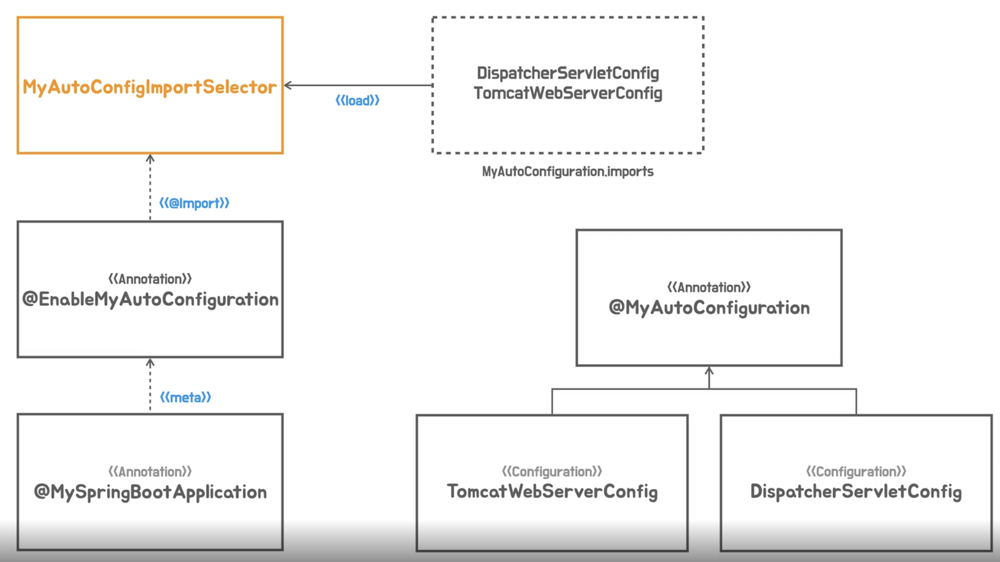

# study-toby-springbooot

1. 스프링 부트 살펴보기
2. 스프링 부트 시작하기
3. 독립 실행형 서블릿 애플리케이션
    1. Containerless 개발 준비
    2. 서블릿 컨테이너 띄우기
    3. 서블릿 등록
        - 웹 클라이언트가 서블릿 컨테이너에게 요청을 해서 해당 작업을 서블릿에게 알려주는것을 매핑(Mapping)이라고 한다.
        - Request
          - Request Line : Method, Path, HTTP Version
          - Headers
          - Message Body
        - Response
          - Status Line : HTTP Version, Status Code, Status Text
          - Headers
          - Message Body
    4. 서블릿 요청 처리
    5. 프론트 컨트롤러
        - 모든 서블릿에 공통적인 코드를 처리하는 부분
          - 인증/보안, 다국어 등등 공통적인 사항을 처리한다.
    6. 프론트 컨트롤러로 전환
    7. Hello 컨트롤러 매핑과 바인딩 
4. 독립 실행형 스프링 애플리케이션
    1. 스프링 컨테이너 사용
        - 스프링 컨테이너는 Your Business Objects(POJOs)와 Configuration Metadata 가 필요하다
        - 스프링 컨테이너가 두 가지를 조합해서 내부의 빈을 구성해서 서블릿 애플리케이션을 만든다.용
    2. 의존 오브젝트 추가
        - 스프링 컨테이너는 하나의 오브젝트만 만들고 이것을 계속 사용한다.
        - 이것을 싱글톤이라고 한다.
        - 역할에 따라서 기능을 계속 만든다.
    3. Dependency Injection
        - HelloController 는 SimpleHelloService 에 의존하고 있다.
          - SimpleHelloService 의 변경에 따라 HelloController 는 영향을 받는다.
        - HelloController 는 HelloService interface 를 두고 SimpleHelloService 와 ComplexHelloService 구현체를 따로 만든다.
        - 외부에서 HelloController 가 사용할 수 있게 Assembler(조립)을 한다.
        - 스프링 컨테이너가 빈으로 등록하고 주입을 해준다.
    4. 의존 오브젝트 DI 적용
    5. DispatcherServlet 으로 전환 
    6. 애노테이션 매핑 정보 사용
    7. 스프링 컨테이너로 통합
    8. 자바코드 구성 정보 사용
        - 팩토리 메소드 사용해서 빈을 등록한다.
    9. @Component 스캔
    10. Bean 의 생명주기 메소드
    11. SpringBootApplication
5. DI와 테스트, 디자인 패턴트
    1. 테스트 코드를 이용한 테스트
    2. DI 와 단위 테스트 
    3. DI 를 이용한 Decorator, Proxy 패턴
        - HelloController 는 추상화된 인터페이스 HelloService 를 의존한다.
          - HelloService 를 수정하지 않고 구현체를 여러개 만들어 변경 가능하다
          - 변경 가능하기 위해서는 의존주입(DI)이 필요하다
6. 잗동 구성 기반 애플리케이션
    1. 메타 애노테이션과 합성 애노테이션
        - 메타 애노테이션
          - 메타 애노테이션을 사용하면 기능적인면에서 차이는 없다
          - 다른 이름을 부여하면 그 클래스의 추가적인 정보를 얻을 수 있다.
          - 부가적인 기능을 유추 할 수 있다.
          - 새롭게 만들면 메타 애노테이션에 없던 걸 만들어서 확장 할 수 있다.
          - 애노테이션에는 상속이라는 개념은 없다
          - 애노테이션은 리텐션@Retention 과 타겟@Target 을 무조건 있어야 한다
        - 합성 애노테이션
          - 반복적으로 애노테이션이 많이 붙는다면 합성 애노테이션을 붙혀서 코드를 좀 더 깔끔하게 할 수 있다.
    2. 합성 애노테이션의 적용
    3. 빈 오브젝트의 역할과 구분
        - 애플리케이션 빈(사용자 구성정보 = ComponentScan)
          - 사용자가 만들어서 빈으로 등록해서 사용함
          - HelloController
          - HelloDecorator
          - SimpleHelloService
        - 컨테이너 인프라스트럭처 빈(자동 구성정보 = AutoConfiguration)
          - 컨테이너가 스스로 빈으로 등록해서 사용함
          - 이것은 스프링 컨테이너의 기능이다
          - TomcatServletWebServerFactory
          - DispatcherServlet
    4. 인프라 빈 구성 정보의 분리
    5. 동적인 자동 구성 정보 등록
    6. 자동 구성 정보 파일 분리
    7. 자동 구성 애노테이션 적용
        
7. 조건부 자동 구성
    1. 스타터와 Jetty 서버 구성 추가
        - MyAutoConfiguration -> AutoConfiguration
          - org.springframework.autoconfigure.AutoConfiguration.imports 에 기본적으로 빈 구성정보를 가지고 있다.
          - 등록된 빈을 다 사용하는것이 아니라 조건부에 따라서 빈으로 등록할지 말지 정할 수 있다.
        - Tomcat 은 라이브러이이다