# study-toby-springboot 저장소입니다.

## 인프런 강의명 : [토비의 스프링 부트 - 이해와 원리](https://www.inflearn.com/course/%ED%86%A0%EB%B9%84-%EC%8A%A4%ED%94%84%EB%A7%81%EB%B6%80%ED%8A%B8-%EC%9D%B4%ED%95%B4%EC%99%80%EC%9B%90%EB%A6%AC)

## 목차

1. 스프링 부트 살펴보기

2. 스프링 부트 시작하기

3. 독립 실행형 서블릿 애플리케이션
    1. Containerless 개발 준비
        

        
Container

        
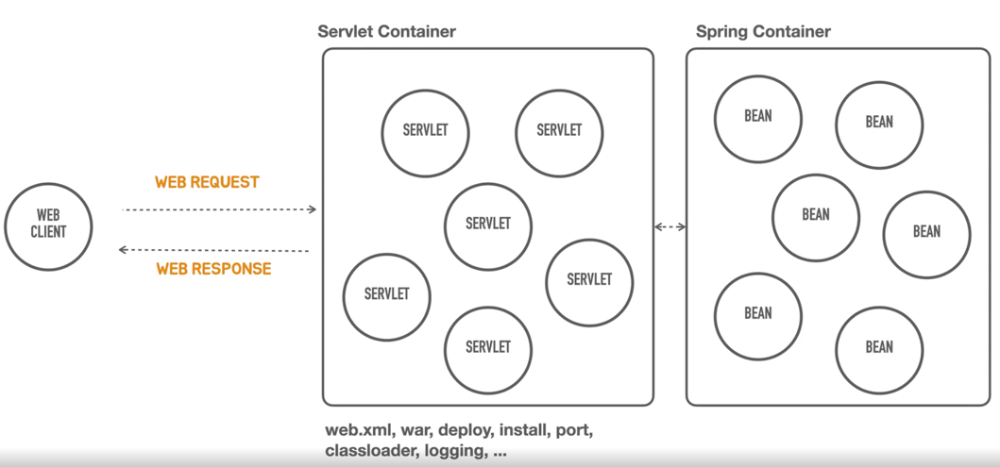

        

    2. 서블릿 컨테이너 띄우기
        

        
Servlet Container

        
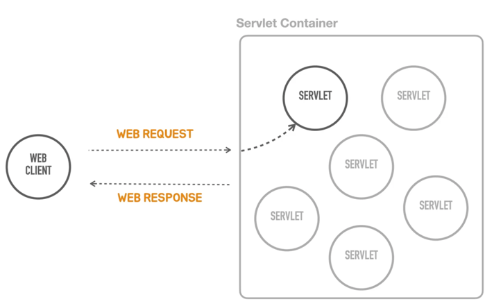

        

    3. 서블릿 등록
        

        
Servlet Container Mapping

        
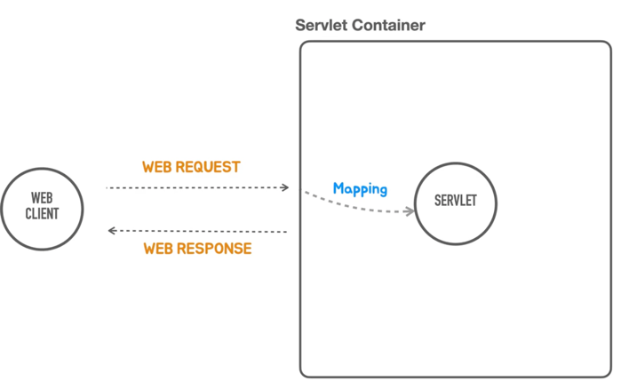
        

       
        - 웹 클라이언트가 서블릿 컨테이너에게 요청을 해서 해당 작업을 서블릿에게 알려주는것을 매핑(Mapping)이라고 한다.
        - Request
          - Request Line : Method, Path, HTTP Version
          - Headers
          - Message Body
        - Response
          - Status Line : HTTP Version, Status Code, Status Text
          - Headers
          - Message Body
    4. 서블릿 요청 처리
    5. 프론트 컨트롤러
        

        
Front Controller

        
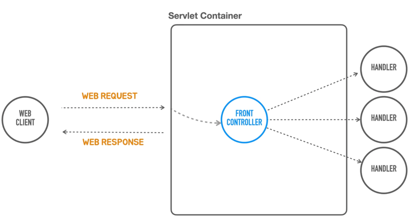

        

       
        - 모든 서블릿에 공통적인 코드를 처리하는 부분
          - 인증/보안, 다국어 등등 공통적인 사항을 처리한다.
    6. 프론트 컨트롤러로 전환
    7. Hello 컨트롤러 매핑과 바인딩

4. 독립 실행형 스프링 애플리케이션
    1. 스프링 컨테이너 사용
        

        
Spring Controller

        
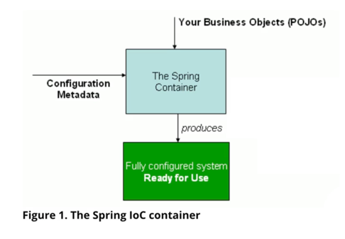

        

       
        - 스프링 컨테이너는 Your Business Objects(POJOs)와 Configuration Metadata 가 필요하다
        - 스프링 컨테이너가 두 가지를 조합해서 내부의 빈을 구성해서 서블릿 애플리케이션을 만든다.용
    2. 의존 오브젝트 추가
        

        
Spring Controller

        
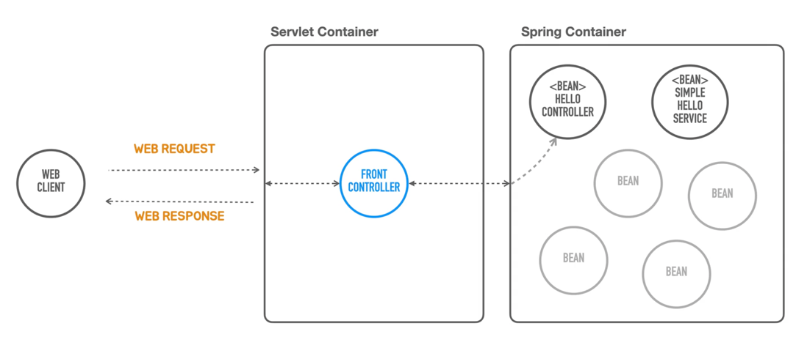

        

       
        - 스프링 컨테이너는 하나의 오브젝트만 만들고 이것을 계속 사용한다.
        - 이것을 싱글톤이라고 한다.
        - 역할에 따라서 기능을 계속 만든다.
    3. Dependency Injection
        

        
Spring Container (Assembler)

        

        

       
        - HelloController 는 SimpleHelloService 에 의존하고 있다.
          - SimpleHelloService 의 변경에 따라 HelloController 는 영향을 받는다.
        - HelloController 는 HelloService interface 를 두고 SimpleHelloService 와 ComplexHelloService 구현체를 따로 만든다.
        - 외부에서 HelloController 가 사용할 수 있게 Assembler(조립)을 한다.
        - 스프링 컨테이너가 빈으로 등록하고 주입을 해준다.
    4. 의존 오브젝트 DI 적용
    5. DispatcherServlet 으로 전환 
    6. 애노테이션 매핑 정보 사용
    7. 스프링 컨테이너로 통합
    8. 자바코드 구성 정보 사용
        - 팩토리 메소드 사용해서 빈을 등록한다.
    9. @Component 스캔
    10. Bean 의 생명주기 메소드
    11. SpringBootApplication

5. DI와 테스트, 디자인 패턴트
    1. 테스트 코드를 이용한 테스트
    2. DI 와 단위 테스트 
    3. DI 를 이용한 Decorator, Proxy 패턴
        

        
Spring Container (Assembler)

        
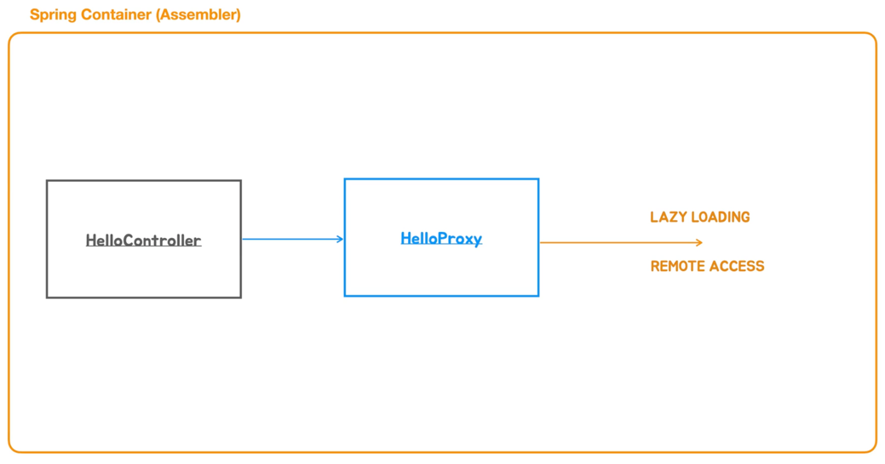

        

       
        - HelloController 는 추상화된 인터페이스 HelloService 를 의존한다.
          - HelloService 를 수정하지 않고 구현체를 여러개 만들어 변경 가능하다
          - 변경 가능하기 위해서는 의존주입(DI)이 필요하다

6. 자동 구성 기반 애플리케이션
    1. 메타 애노테이션과 합성 애노테이션
        

        
메타 애노테이션 구성도

        
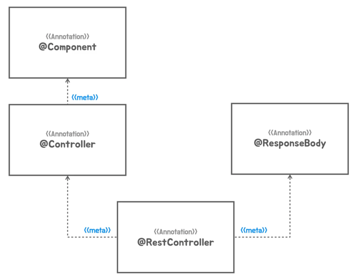

        

       
        - 메타 애노테이션
          - 메타 애노테이션을 사용하면 기능적인면에서 차이는 없다
          - 다른 이름을 부여하면 그 클래스의 추가적인 정보를 얻을 수 있다.
          - 부가적인 기능을 유추 할 수 있다.
          - 새롭게 만들면 메타 애노테이션에 없던 걸 만들어서 확장 할 수 있다.
          - 애노테이션에는 상속이라는 개념은 없다
          - 애노테이션은 리텐션@Retention 과 타겟@Target 을 무조건 있어야 한다
        - 합성 애노테이션
          - 반복적으로 애노테이션이 많이 붙는다면 합성 애노테이션을 붙혀서 코드를 좀 더 깔끔하게 할 수 있다.
    2. 합성 애노테이션의 적용
    3. 빈 오브젝트의 역할과 구분
        - 애플리케이션 빈(사용자 구성정보 = ComponentScan)
          - 사용자가 만들어서 빈으로 등록해서 사용함
          - HelloController
          - HelloDecorator
          - SimpleHelloService
        - 컨테이너 인프라스트럭처 빈(자동 구성정보 = AutoConfiguration)
          - 컨테이너가 스스로 빈으로 등록해서 사용함
          - 이것은 스프링 컨테이너의 기능이다
          - TomcatServletWebServerFactory
          - DispatcherServlet
    4. 인프라 빈 구성 정보의 분리
        

        
인프라 빈 구성도

        

        

    5. 동적인 자동 구성 정보 등록
        

        
동적인 자동 구성도

        

        

    6. 자동 구성 정보 파일 분리
    7. 자동 구성 애노테이션 적용
        

        
자동 구성 애노테이션 구성도

        

        

7. 조건부 자동 구성
    1. 스타터와 Jetty 서버 구성 추가
        - MyAutoConfiguration -> AutoConfiguration
          - org.springframework.autoconfigure.AutoConfiguration.imports 에 기본적으로 빈 구성정보를 가지고 있다.
          - 등록된 빈을 다 사용하는것이 아니라 조건부에 따라서 빈으로 등록할지 말지 정할 수 있다.
        - Tomcat 은 라이브러이이다
    2. @Conditional 과 Condition
        

        
조건부 구성도

        
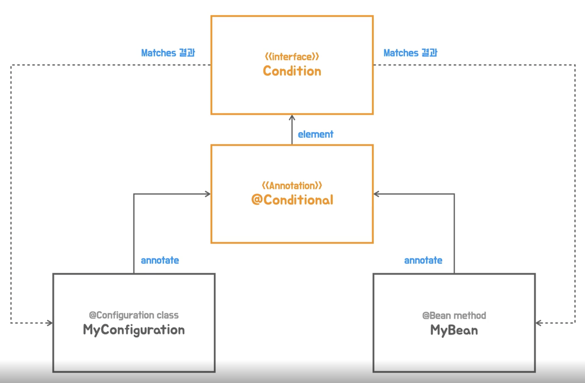

        

    3. @Conditional 학습테스트 
    4. 커스텀 @Conditional
        

        
커스텀 조건부 애노테이션 구성도

        
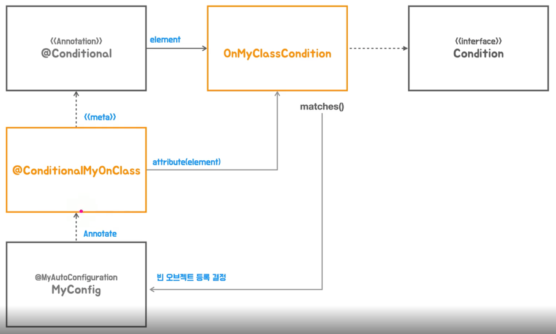

        

    5. 자동 구성정보 대체하기
        

        
사용자 정보구성과 자동 구성정보 구성도

        
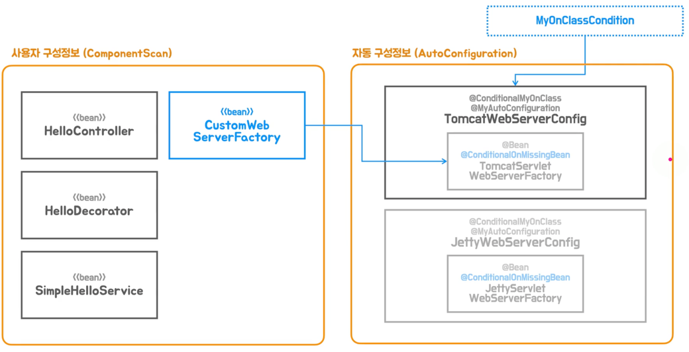

        

       
        - 유조 구성정보(ComponentScan), 자동 구성정보(AutoConfiguration)
        - 유저 구성정보에 등록된 빈이 우선적으로 등록된다.
    6. 스프링 부트의 @Conditional
        - 스프링 프레임워크의 @Profile 도 @Conditional 애노테이션이다.
        - Class Conditions
          - @ConditionalOnClass
          - @ConditionalOnMissingClass
          > 지정한 클래스의 프로젝트내 존재를 확인해서 포함 여부를 결정한다.
        - Bean Conditions
          - @ConditionalOnBean
          - @ConditionalOnMissingBean
          > 빈의 존재 여부를 기준으로 포함여부를 결정한다.  
            빈의 타입 또는 이름을 지정할 수 있다. 
            지정된 빈 정보가 없으면 메소드의 리턴 타입을 기준으로 빈의 존재여부를 체크한다.
        - Property Conditions
          > @ConditionalOnProperty 는 스프링의 환경 프로퍼티 정보를 이용한다. 
            지정된 프로퍼티가 존재하고 값이 false 가 아니면 포함 대상이 된다. 
            특정 값을 가진 경우를 확인하거나 프로퍼티가 존재하지 않을 때 조건을 만족하게 할 수도 있다.
        - Resource Conditions
          > @ConditionalOnResource 는 지정된 리소스(파일)의 존재를 확인하는 조건이다.
        - Web Application Conditions
          - @ConditionalOnWebApplication
          - @ConditionalOnNotWebApplication
          > 웹 애플리케이션 여부를 확인한다. 
            모든 스프링 부트 프로젝트가 웹 기술을 사용해야 하는 것은 아니다.
        - SpEL Expression Conditions
          > @ConditionalOnExpression 은 스프링 SpEL(스프링 표현식)의 처리 결과를 기준으로 판단한다. 
            매우 상세한 조건 설정이 가능하다.

8. 외부 설정을 이용한 자동 구성
    1. Environment 추상화와 프로퍼티
        

        
스프링의 Environment 추상화

        

        

       
        - StandardEnvironment
          - System Properties
          - System Environment Variables
        - StandardServletEnvironment
          - ServletConfig Parameters
          - ServletContext Parameters
          - JNDI
          - @PropertySource
        - SpringBoot
          - application.properties, xml, yml
        - 프로퍼티 정보로 설정을 바꿀 수 있다.
        - 스프링이 다양한 설정을 바꿀 수 있게 프로퍼티를 제공한다.
    2. 자동 구성에 Environment 프로퍼티 적용
        - properties 우선순위
          1. System Properties
          2. Environment Properties
          3. Application Properties
        - contextPath
          - 모든 요청의 path를 설정하게 된다.
            - contextPath=/app
              - /app/hello?name=spring
    3. @Value 와 PropertySourcePlaceholderConfigurer
       - 빈으로 등록 될 때 @Value 실행된다.
    4. 프로퍼티 클래스의 분리
    5. 프로퍼티 빈의 후처리기 도입